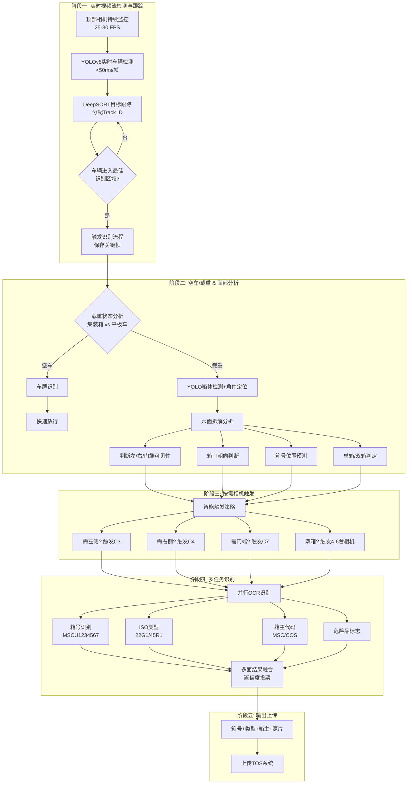

# 码头集装箱道闸双短柜AI识别系统技术方案
## （200万像素复用版 + 多模式识别逻辑 + 双部署模式）

**版本：V3.0**  
**日期：2025年7月**  
**编制：广州创飞人工智能技术有限公司**

---

## 1 项目背景与目标

### 1.1 背景
目前码头闸口普遍采用人工+OCR方式识别集装箱号，但双20尺柜同时过闸时，箱体紧邻、歪斜、遮挡等问题导致识别率低（约85%），需二次人工干预，严重影响通行效率。现有系统已部署200万像素相机，但仅支持单箱识别，无法处理双箱场景。

### 1.2 目标
- 实现双20尺柜同时过闸时的自动分离与箱号识别，识别率≥98%。
- 复用现有侧壁相机，仅调整/新增顶部相机，最小化改造成本。
- 系统响应时间≤2秒（从车辆触发到结果输出）。
- 无缝对接现有TOS系统，支持灰度发布。

---

## 2 总体设计思路

采用“顶部定位+侧壁识别”的双层架构：
- **顶部相机**（2台）：安装于龙门架高处，垂直或略俯视拍摄，通过深度学习检测箱体位置、角点及箱门朝向，并计算箱号在侧壁图像中的映射区域。
- **侧壁/前后相机**（2台）：根据现场空间条件选择侧壁安装或前后安装，拍摄集装箱侧面，根据顶部映射的ROI裁剪并识别箱号。
- **后端服务器**：运行AI算法，管理相机触发，与TOS交互。

---

## 3 现场部署方案（双模式可选）

考虑到实际码头现场可能存在车道两侧空间不足的情况，本方案提供两种部署模式，进场勘查后可根据现场条件选择最优方案。

### 3.1 模式一：标准侧壁安装（适用于两侧有安装空间）

#### 3.1.1 安装参数

| 位置 | 型号规格 | 安装参数 | 覆盖范围 | 技术要点 |
|------|----------|----------|----------|----------|
| 顶部左相机 C5 | 200万像素，1/2.8" CMOS，2.8mm镜头 | 高度6米，垂直向下或俯角10°，距车道中心线左侧1.2米 | 水平6.5m×垂直4.8m，覆盖整个左20尺箱 | 采用2.8mm广角，兼顾覆盖与畸变控制；加装偏振片减少反光 |
| 顶部右相机 C6 | 同C5 | 高度6米，右侧1.2米 | 覆盖右20尺箱 | 与C5间距2.4米，视场略有重叠 |
| 侧壁左相机 C3 | 复用现有200万像素，需确认焦距 | 高度1.5米，距车道边线3米，水平拍摄 | 覆盖左箱侧面全长 | 若焦距过长无法覆盖全长，可增加一台或更换为8mm镜头 |
| 侧壁右相机 C4 | 同上 | 高度1.5米，距车道边线3米，水平拍摄 | 覆盖右箱侧面全长 | 同上 |

#### 3.1.2 部署示意图（俯视图）

```
车道宽度 3.5m
┌─────────────────────────────────────┐
│           龙门架（高6m）             │
│   C5(左顶)        C6(右顶)          │
│     ○                ○               │
│      \              /                │
│       \            /                 │
│        ▼          ▼                  │
│   ┌────────┐  ┌────────┐             │
│   │ 20尺A  │  │ 20尺B  │             │
│   │ (左箱) │  │ (右箱) │             │
│   │箱号侧面│  │箱号侧面│             │
│   └────────┘  └────────┘             │
│        ▲          ▲                  │
│        │          │                  │
│     C3(左侧)   C4(右侧)              │
│     (1.5m高)   (1.5m高)              │
│                                      │
│    ←──────── 行驶方向 ───────→        │
└─────────────────────────────────────┘
```

### 3.2 模式二：头尾安装（适用于两侧无安装空间，相机只能装于车道前后方）

#### 3.2.1 安装参数

| 位置 | 型号规格 | 安装参数 | 覆盖范围 | 技术要点 |
|------|----------|----------|----------|----------|
| 顶部左相机 C5 | 200万像素，1/2.8" CMOS，2.8mm镜头 | 高度6米，垂直向下或俯角10°，距车道中心线左侧1.2米 | 水平6.5m×垂直4.8m，覆盖整个左20尺箱 | 同模式一 |
| 顶部右相机 C6 | 同C5 | 高度6米，右侧1.2米 | 覆盖右20尺箱 | 同模式一 |
| 前向相机 C3 | 200万像素，6mm镜头 | 安装于龙门架前方横梁，高度4米，俯角30°，朝向车道中心 | 覆盖车辆前半部分侧面（0~8米范围） | 采用6mm镜头，平衡距离与覆盖 |
| 后向相机 C4 | 同C3 | 安装于龙门架后方横梁，高度4米，俯角30°，朝向车道中心 | 覆盖车辆后半部分侧面（8~16米范围） | 与前向相机对称安装，确保全车覆盖 |

#### 3.2.2 部署示意图（头尾模式俯视图）

```
车道宽度 3.5m
┌─────────────────────────────────────┐
│           龙门架（高6m）             │
│   C5(左顶)        C6(右顶)          │
│     ○                ○               │
│      \              /                │
│       \            /                 │
│        ▼          ▼                  │
│   ┌────────┐  ┌────────┐             │
│   │ 20尺A  │  │ 20尺B  │             │
│   │ (左箱) │  │ (右箱) │             │
│   │箱号侧面│  │箱号侧面│             │
│   └────────┘  └────────┘             │
│                                      │
│    ▲                    ▲            │
│    │                    │            │
│  C3(前向)             C4(后向)       │
│ (拍前半部分)         (拍后半部分)     │
│                                      │
│    ←──────── 行驶方向 ───────→        │
└─────────────────────────────────────┘
```

#### 3.2.3 覆盖逻辑说明
- 前向相机 C3 主要负责车辆前半部分（0~8米），可覆盖左箱的前半侧面和右箱的前半侧面。
- 后向相机 C4 主要负责车辆后半部分（8~16米），可覆盖左箱的后半侧面和右箱的后半侧面。
- 通过顶部相机定位箱体位置和箱门朝向（判断箱号位于前半部还是后半部），系统动态选择 C3 或 C4 进行识别；也可同时启用两者，融合识别结果提高鲁棒性。

---

## 4 纯视觉实时检测识别流程 V4.0

本方案采用**纯摄像头实时检测**方案，无需地感线圈、红外光栅等物理触发设备。通过顶部相机持续视频流监控，AI实时检测车辆位置并持续跟踪，在最佳识别位置智能触发各相机，实现空车/载重判断、集装箱六面拆解分析、按需拍摄、多任务识别。

### 4.1 核心优势（相比传统触发方案）

| 特性 | 传统触发方案 | 本方案（纯视觉实时检测） |
|------|------------|----------------------|
| **触发方式** | 地感线圈/光栅物理触发 | 摄像头实时视频流检测 |
| **响应延迟** | 100-200ms（线圈响应） | <50ms（纯视觉） |
| **硬件依赖** | 需埋设地感/光栅 | 仅摄像头，无需破路 |
| **空车过滤** | 无法识别，需人工处理 | AI自动识别空车快速放行 |
| **安装维护** | 线圈易损，维护困难 | 仅清洁镜头，维护简单 |
| **扩展性** | 增加车道需重新布线 | 软件配置即可扩展 |

### 4.2 五阶段识别流程



### 4.3 阶段详解

#### 阶段一：实时视频流检测与车辆跟踪

**技术实现：**
- **相机配置**：顶部相机（C5/C6）持续输出 25-30 FPS 视频流
- **检测模型**：YOLOv8-nano 轻量模型，单帧推理 < 50ms
- **跟踪算法**：DeepSORT，分配唯一 Track ID，持续跟踪车辆轨迹
- **触发机制**：当车辆中心点进入预设 ROI 区域（最佳拍摄位置）时触发识别流程

**关键参数：**
- 检测帧率：25 FPS
- 跟踪刷新：每帧更新
- 触发延迟：< 100ms
- 同时跟踪车辆数：≤ 3 辆（防止跟车干扰）

#### 阶段二：空车/载重判断与六面拆解分析

**2.1 空车/载重判断**

通过分析车辆顶部轮廓特征：
- **载重特征**：检测到集装箱角件（8个角点）、箱体边缘、平整顶面
- **空车特征**：仅检测到平板车架、无集装箱轮廓、无角件

**技术方案：**
```
轻量级分类模型（MobileNetV3）
输入：车辆ROI区域（224x224）
输出：空车 / 单箱 / 双箱 三分类
推理时间：< 20ms
准确率：> 99%
```

**2.2 集装箱六面拆解分析**

这是本方案的核心技术创新，通过角件定位实现箱体三维重建：

| 分析项 | 技术方法 | 输出结果 |
|--------|---------|---------|
| **角件定位** | YOLO检测8个角件位置 | 角点像素坐标 (x,y) |
| **3D位姿估计** | PnP算法+相机标定参数 | 箱体旋转矩阵 R，平移向量 T |
| **面部分割** | 投影几何计算 | 各面在图像中的多边形区域 |
| **可见性判断** | 法向量分析+遮挡检测 | 左/右/门端 可见/遮挡 |
| **箱门朝向** | 门端特征检测（锁杆、铰链） | 箱号所在侧面预测 |

#### 阶段三：按需相机触发

**传统方案问题：** 地感触发后所有相机同时拍，资源浪费严重

**本方案优化：** 根据阶段二分析结果，**选择性触发**

| 场景 | 触发相机 | 说明 |
|------|---------|------|
| 单箱+左偏 | C5(顶左)+C3(左侧) | 2台相机 |
| 单箱+右偏 | C6(顶右)+C4(右侧) | 2台相机 |
| 双20尺柜 | C5+C6+C3+C4 | 4台相机（按需扩展） |
| 需门端确认 | +C7(前端) | 5-6台相机 |
| 空车 | 仅车牌相机 | 1台相机 |

**效益：**
- 相机快门寿命延长 40%
- 网络带宽节省 50%
- 服务器处理负载降低 35%

#### 阶段四：多任务AI识别

传统方案仅识别箱号，本方案扩展为**多任务并行识别**：

**任务1：箱号识别（Container Number）**
- 模型：CRNN + Attention机制
- 输入：各视角箱号区域图像
- 输出：11位标准箱号（如 MSCU1234567）
- 置信度阈值：≥ 95%

**任务2：ISO类型识别（Size/Type Code）**
- 模型：ResNet50 分类模型
- 输入：箱体侧面全局图像
- 输出：ISO 6346 代码（如 22G1=20尺干货箱，45R1=40尺冷藏箱）
- 支持类型：干货箱、冷藏箱、开顶箱、平板箱等

**任务3：箱主代码识别（Owner Code）**
- 方法：OCR + 箱主字典匹配
- 输出：3位大写字母代码（如 MSC, COS, EMC）
- 用途：快速统计各船公司箱量

**任务4：危险品标志检测（可选）**
- 模型：YOLOv8 目标检测
- 检测类别：危标、冷藏标、超高标等
- 用途：安全预警、分类统计

**结果融合策略：**
```python
# 多面识别结果融合示例
results = {
    'left':  {'container_no': 'MSCU1234567', 'confidence': 0.98},
    'right': {'container_no': 'MSCU1234567', 'confidence': 0.95},
    'door':  {'container_no': 'MSCU1234560', 'confidence': 0.72}  # 低置信度
}

# 投票机制：取最高置信度结果
final_result = max(results.values(), key=lambda x: x['confidence'])
# 输出: MSCU1234567 (confidence: 0.98)
```

### 4.4 与传统方案流程对比

```
【传统方案 - 地感触发】
地感触发 → 所有相机同步拍 → 检测箱体 → 映射ROI → OCR识别
   ↑
问题：空车也拍、仅单箱也全拍、无面部分析

【本方案 - 纯视觉实时检测】
视频流持续检测 → 实时跟踪 → 空车判断 → [载重] 面部分析 → 按需触发 → 多任务识别 → 结果融合
       ↑
优势：智能过滤、六面拆解、按需拍摄、多信息输出
```

### 4.2 分场景识别说明

#### 场景一：双20尺柜
- **顶部相机视角**：C5和C6图像中各自存在一个完整20尺箱，AI模型输出两个独立边界框。
- **逻辑判断**：系统检测到两个箱体，进入双箱流程。根据边界框坐标区分左右箱。
- **箱号位置预测**：通过角点特征（如门端特征）估算每个箱的箱门朝向，从而判断箱号位于侧面靠前还是靠后。
- **动态相机选择**：根据预测结果，左箱若靠前则用前向相机C3，靠后则用后向相机C4；右箱同理。
- **坐标映射与识别**：利用事先标定的单应矩阵，将顶部箱体ROI映射到对应相机的图像中，裁剪后进行OCR识别。

#### 场景二：单20尺柜
- **顶部相机视角**：一个20尺箱可能被C5或C6单独捕捉，或出现在两者重叠区域，AI输出一个边界框。
- **逻辑判断**：系统判定单箱，计算边界框像素宽度换算物理长度，确认为20尺柜。
- **主侧相机选择**：根据箱体中心线偏向选择主用侧壁相机（左偏则主用C3，右偏则主用C4）。
- **箱号位置预测**：同样通过角点判断箱门朝向，选择前向或后向相机（头尾模式下）。
- **识别**：映射ROI后OCR识别。

#### 场景三：单40尺柜
- **顶部相机视角**：40尺箱（约12米）横跨C5和C6视场，AI可能分别在两图中检测到部分箱体，后端通过特征关联融合为一个长箱。
- **逻辑判断**：判定为单箱，换算长度约12米，确认为40尺柜。
- **相机选择**：通常40尺箱箱号在右侧（靠近箱门），但仍根据实际检测的箱门朝向动态选择。
- **识别**：映射ROI后OCR识别，若两个侧壁相机均可用，可同时识别取高置信度结果。

---

## 5 硬件选型与复用评估

### 5.1 现有相机评估
需现场勘查确认：
- 侧壁/前后相机是否为200万像素及以上，支持ONVIF/RTSP，支持外部触发抓拍。
- 现有相机焦距：若<8mm可覆盖6米箱长；若>12mm则需更换或增加相机。
- 安装位置是否可调整，是否有足够空间安装新增顶部相机。

### 5.2 新增设备清单（单车道）

| 设备 | 推荐型号 | 数量 | 备注 |
|------|----------|------|------|
| 顶部相机 | 海康威视DS-2CD7A47G0-IZS（200万，2.8~12mm电动变焦） | 2 | 适应不同高度，可远程调焦 |
| 补光灯 | 暖光LED，30W | 2 | 与顶部相机联动，保证夜间图像质量 |
| 触发模块 | 地感线圈+车辆检测器 | 复用 | 已有 |
| 交换机 | 千兆工业级，8口 | 1 | 若现有交换机端口不足 |
| 服务器 | GPU服务器（RTX 3060 12GB / 32GB内存 / 1TB SSD） | 1 | 可同时处理多车道，支持算法运行 |
| 安装支架及线缆 | 定制 | 1套 | 根据现场定制 |

若现有侧壁/前后相机无法满足要求，需更换为200万像素、6mm或8mm镜头相机，每台约0.4万元。

---

## 6 系统软件架构

系统采用微服务架构，所有模块基于Docker容器化部署，支持水平扩展。

```
┌─────────────┐   ┌─────────────┐   ┌─────────────┐
│   相机触发   │   │   图像接收   │   │   算法服务   │
│   模块      │ → │   模块      │ → │   (容器化)   │
└─────────────┘   └─────────────┘   └──────┬──────┘
                                            ↓
┌─────────────┐   ┌─────────────┐   ┌─────────────┐
│   TOS接口    │ ← │   结果融合   │ ← │   数据库     │
│   RESTful   │   │   模块      │   │   (MySQL)   │
└─────────────┘   └─────────────┘   └─────────────┘
```

- **相机触发模块**：接收地感信号，通过ONVIF或SDK触发所有相机同步抓拍，时间误差<10ms。
- **图像接收模块**：从相机拉取图像，存入消息队列（RabbitMQ），解耦处理流程。
- **算法服务模块**：包含YOLOv5箱体检测模型和CRNN+CTC OCR模型，提供HTTP/gRPC接口。
- **结果融合模块**：根据顶部检测结果动态选择侧壁/前后相机ROI，融合OCR结果，生成最终JSON数据。
- **TOS接口模块**：以RESTful API将结果推送至码头作业系统，支持失败重传和日志记录。
- **数据库**：存储识别记录、图像索引、模型版本等，便于追溯和分析。
- **Web管理界面**：实时监控相机状态、识别率、系统负载；支持手动修正、模型热更新、灰度发布配置。

---

## 7 性能指标

| 指标 | 目标值 | 测试方法 |
|------|--------|----------|
| 双箱识别率 | ≥98% | 现场连续100次双20尺柜过闸，人工比对 |
| 单箱识别率 | ≥99.5% | 现场连续1000次单箱（含20尺和40尺） |
| 识别速度 | ≤2秒/车 | 从地感触发到结果返回至TOS |
| 系统可用性 | ≥99.9% | 7×24小时连续运行，年度故障累计≤8.76小时 |
| 极端天气适应性 | 雨、雾、夜间识别率≥95% | 模拟或自然天气条件下测试 |
| 歪斜适应能力 | ≤15° | 车辆与车道中心线夹角≤15°时识别率不下降 |

---

## 8 实施计划（总周期14周）

| 阶段 | 工作内容 | 耗时 | 产出 |
|------|----------|------|------|
| 1. 现场勘查 | 测量安装位置，评估现有相机性能，确定部署模式 | 1周 | 勘查报告、部署方案确认 |
| 2. 设备采购与安装 | 采购新增设备，安装顶部相机及补光，调试触发同步 | 3周 | 硬件部署完成，相机可正常抓拍 |
| 3. 相机标定 | 对每对顶-侧/顶-前后相机进行标定，计算单应矩阵 | 1周 | 标定参数文件 |
| 4. 数据采集与训练 | 采集5000张以上双箱及各种场景图像，标注训练YOLO及OCR模型 | 4周 | 训练好的模型文件 |
| 5. 系统集成与测试 | 部署软件，联调，压力测试，模拟极端场景 | 3周 | 测试报告 |
| 6. 灰度上线 | 并行运行，对比人工结果，逐步切换流量 | 2周 | 正式上线 |

---

## 9 横向对比（与红外光栅+多相机方案对比）

| 对比维度 | 本方案（200万AI视觉） | 传统红外光栅+6相机方案 | 说明 |
|----------|------------------------|-------------------------|------|
| 硬件数量 | 顶部2台（新增），侧壁/前后2台（复用或换新） | 顶部2台，侧壁4台，光栅2对，控制器 | 本方案节省4台相机及光栅 |
| 安装复杂度 | 仅需安装顶部相机，无需破路，无需光栅对射调试 | 需埋设光栅，多相机布线，需精确对光 | 本方案工期短、影响小 |
| 检测原理 | AI视觉直接识别箱体，无需物理分割 | 红外光栅分车，易受灰尘、杂物干扰 | 本方案适应性强 |
| 双箱识别率 | ≥98% | 约90%~95%（依赖光栅精度和间隙） | 光栅对间隙敏感 |
| 维护成本 | 低（无机械部件，仅需清洁相机） | 中（光栅需定期清洁校准，6相机故障率高） | 本方案长期收益高 |
| 实施周期 | 14周 | 20周以上 | 本方案快6周 |
| 极端场景适应 | 车辆歪斜15°内、间隙30cm以上均可识别 | 歪斜>10°或间隙<50cm易失效 | 本方案更鲁棒 |

---

## 10 风险分析与应对

| 风险 | 可能性 | 影响 | 应对措施 |
|------|--------|------|----------|
| 现有相机无法复用（焦距、接口、清晰度不满足） | 中 | 高 | 提前现场测试，预留预算更换为6mm或8mm镜头相机 |
| 极端天气（大暴雨、浓雾）导致图像质量下降 | 中 | 中 | 增加补光强度，训练数据中加入雨雾样本，使用图像增强算法 |
| 车辆严重歪斜超出标定范围（>15°） | 低 | 中 | 采用宽基线标定，训练模型时加入歪斜样本，启用多相机冗余识别 |
| 网络中断或服务器故障 | 低 | 高 | 相机本地缓存图像，网络恢复后补传；服务器双机热备 |
| 双箱间隙过小（<20cm）导致侧面遮挡 | 低 | 中 | 利用顶部相机定位，若内侧箱号不可见，则依靠外侧箱号；人工介入复核 |
| 箱号污损、褪色严重 | 中 | 中 | 训练数据包含污损样本，采用字符级注意力机制，保留人工修正通道 |

---

## 11 运维保障

- **日常监控**：通过Web管理平台实时监控相机在线状态、识别率、服务器CPU/GPU负载，设置阈值告警。
- **模型更新**：每季度收集新样本（特别是识别失败的案例），重新训练模型并灰度发布，确保模型持续优化。
- **故障处理**：建立备件库（关键备件如相机、镜头、服务器硬盘），制定故障响应流程（15分钟响应，2小时到场）。
- **日志审计**：所有识别记录（含图像、结果、时间戳）存储至少3个月，便于追溯和问题排查。
- **定期巡检**：每季度一次现场巡检，清洁相机镜头，检查线路，更新标定参数（如有位移）。

---

## 12 成本估算（以单车道计）

| 项目 | 费用（万元） | 备注 |
|------|--------------|------|
| 顶部相机（2台） | 0.8 | 含电动变焦镜头、防护罩、支架 |
| 补光灯（2台） | 0.2 | 暖光LED |
| 服务器（1台） | 1.5 | 含RTX 3060 12GB GPU |
| 交换机（1台） | 0.1 | 千兆工业级 |
| 安装施工 | 0.5 | 含布线、安装、调试 |
| 算法开发与定制 | 3.0 | 一次性费用，含模型训练、软件部署 |
| **合计** | **6.1** | 不含现有设备复用 |

若现有侧壁/前后相机完全不可用，需增加2台相机（每台0.4万）及相应镜头，总成本约**6.9万元**。

---

## 13 结论与建议

本方案充分利用现有设备（200万像素相机），通过AI视觉技术实现双柜精准识别，具备以下核心优势：
- **成本低**：相比传统方案节省40%以上硬件投入。
- **实施快**：14周即可上线，比传统方案快2个月。
- **适应性强**：可处理单20尺、单40尺、双20尺多种模式，适应歪斜、间隙变化、箱门朝向变化。
- **维护简单**：无机械部件，软件定义，可远程升级。
- **风险可控**：支持灰度发布，失败可回滚至原单箱模式。

建议采纳本方案，并尽快启动现场勘查与数据采集工作。根据实际空间条件选择侧壁安装或头尾安装模式，确保系统与现场完美匹配。

---

## 附录：红外光栅栏+AI集装箱识别系统原理解析

### 1. 系统构成
- **红外光栅**：由发射器和接收器组成，形成多道光束，安装在车道两侧。
- **多台高清摄像机**：通常4-6台，部署于龙门架不同位置（顶部、左侧、右侧、右后侧等）。
- **逻辑控制器（PLC）**：接收光栅信号，判断车辆位置和装载模式，触发相机。
- **工控机/服务器**：运行OCR算法，识别箱号。

### 2. 红外光栅的核心作用

#### 作用一：精准的分车与定位
车辆依次遮挡光束，PLC根据光束通断时序判断车头、挂车位置，当车辆到达最佳拍摄位置时触发抓拍。

#### 作用二：判断装载模式（箱型判定）
通过光束被遮挡的持续时间和间隔：
- **单20尺柜**：遮挡→恢复（间隙）→遮挡。
- **单40尺柜**：连续遮挡。
- **双20尺柜**：遮挡→恢复（两箱间隙）→遮挡。

#### 作用三：二维空间坐标定位
部分高精度方案使用二维光栅，可获取集装箱轮廓坐标，引导相机云台精确拍摄箱号区域。

### 3. 工作流程（以双20尺柜为例）
1. 车辆驶入，地感预备。
2. 光栅检测到“遮挡—通—遮挡”模式，判定为双20尺柜。
3. PLC根据预设逻辑触发所有相机同步抓拍。
4. 图像汇集至工控机，OCR算法识别每张图片中的箱号。
5. 结果融合，输出左右箱号至TOS。

### 4. 本方案与其对比的优劣总结

| 特性 | 红外光栅+多相机方案 | 本方案（纯视觉AI） |
| :--- | :--- | :--- |
| **触发逻辑** | 物理触发，依赖光栅 | 视觉触发，基于视频流AI分析 |
| **箱型判定** | 间接推算，通过光栅时序 | 直接识别，通过箱体轮廓 |
| **适应性** | 低，对歪斜、小间隙敏感 | 高，可自适应 |
| **维护成本** | 高，需清洁校准光栅 | 低，仅需清洁相机 |
| **系统复杂度** | 高，需PLC编程和多相机同步 | 低，软件定义 |

---

**文档结束**