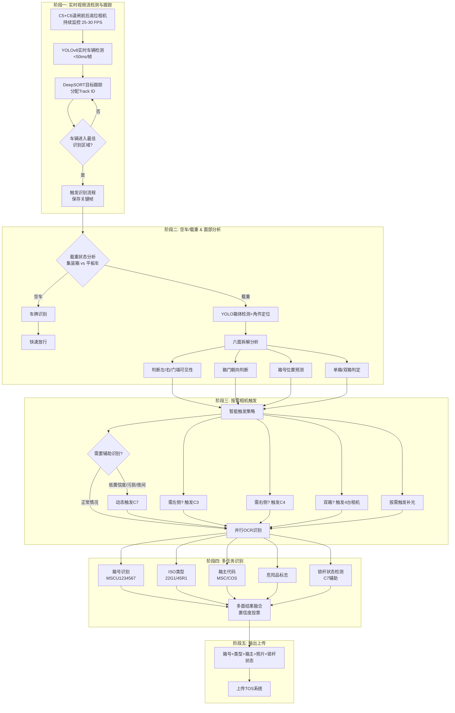

# 码头集装箱道闸双短柜AI识别系统技术方案
## （200万像素复用版 + 多模式识别逻辑 + 双部署模式 + 5.5相机方案）

**版本：V4.0**  
**日期：2025年7月**  
**编制：广州创飞人工智能技术有限公司**

---

## 1 项目背景与目标

### 1.1 背景
目前码头闸口普遍采用人工+OCR方式识别集装箱号，但双20尺柜同时过闸时，箱体紧邻、歪斜、遮挡等问题导致识别率低（约85%），需二次人工干预，严重影响通行效率。现有系统已部署200万像素相机，但仅支持单箱识别，无法处理双箱场景。侧面污损、夜间低光照、ISO码识别等复杂场景更是传统方案的短板。

### 1.2 目标
- 实现双20尺柜同时过闸时的自动分离与箱号识别，识别率≥98%。
- 复用现有侧壁相机，仅新增道闸前后高位相机，最小化改造成本。
- 引入C7辅助相机，解决侧面污损、夜间识别、ISO码识别等痛点场景。
- 系统响应时间≤2秒（从车辆触发到结果输出）。
- 无缝对接现有TOS系统，支持灰度发布。

---

## 2 总体设计思路

采用"顶部定位+侧壁识别+辅助增强"的三层架构：
- **道闸前后高位相机**（2台）：安装于道闸前后上方，高度8-10m，俯角30-45°，通过深度学习检测箱体位置、角点及箱门朝向，并计算箱号在侧壁/头尾图像中的映射区域。
  - C5（道闸前上方，入口侧）：拍摄车尾+后箱
  - C6（道闸后上方，出口侧）：拍摄前箱+车头
- **C3+C4 侧壁/头尾相机**（2台）：根据现场空间条件选择侧壁安装或头尾安装，拍摄集装箱侧面，根据C5/C6映射的ROI裁剪并识别箱号。
  - C3：拍摄后箱侧面（靠近车尾/入口侧）
  - C4：拍摄前箱侧面（靠近车头/出口侧）
- **C7 辅助相机**（0.5台，按需触发）：安装于道闸前侧方低位，专门用于ISO码识别、锁杆检测、侧面污损备用识别，提升极端场景下的识别率。
- **后端服务器**：运行AI算法，管理相机触发，与TOS交互。

---

## 3 现场部署方案（双模式可选）

考虑到实际码头现场可能存在车道两侧空间不足的情况，本方案提供两种部署模式，进场勘查后可根据现场条件选择最优方案。

### 3.1 模式一：侧壁安装（适用于两侧有安装空间，5.5相机）

#### 3.1.1 安装参数

| 位置 | 型号规格 | 安装参数 | 覆盖范围 | 技术要点 |
|------|----------|----------|----------|----------|
| C5 | 200万像素，1/2.8" CMOS，2.8mm镜头 | 道闸前上方，高度8-10m，俯角30-45° | 覆盖道闸前区域及箱体顶部 | 广角镜头，负责实时检测、空车判断、箱体定位 |
| C6 | 同C5 | 道闸后上方，高度8-10m，俯角30-45° | 覆盖道闸后区域及箱体顶部 | 与C5协同，实现箱体全程跟踪 |
| C3 | 复用现有200万像素，6-8mm镜头 | 左侧壁，高度1.5m，距车道3m，水平拍摄 | 覆盖后箱侧面全长 | 主力OCR识别（入口侧/后箱） |
| C4 | 同上 | 右侧壁，高度1.5m，距车道3m，水平拍摄 | 覆盖前箱侧面全长 | 主力OCR识别（出口侧/前箱） |
| C7 | 200万像素，6mm镜头 | 道闸前侧方，高度3-4m，45°角拍摄 | 覆盖箱体侧面细节、锁杆、ISO码区域 | **辅助相机**：ISO码+锁杆+备用识别，按需触发 |

#### 3.1.2 部署示意图（俯视图）

```
车道宽度 5m（容纳横向并排双箱）
┌──────────────────────────────────────────────────────────────┐
│                                                              │
│   C5(道闸前上方)                                             │
│   高度8-10m，俯角30-45°                                       │
│        ○                                                     │
│         \                                                    │
│          \                                                   │
│   C7(侧方低位)  ▼                                              │
│   3-4m高，45°角                                              │
│        ▲                                                     │
│        │                                                     │
│   ╔══════════════════════════════════════════════════════╗   │
│   ║                    【道 闸】                          ║   │
│   ╚══════════════════════════════════════════════════════╝   │
│                                                              │
│   ┌──────────────────────┬──────────────────────┐            │
│   │      20尺A           │      20尺B           │            │
│   │      (后箱)          │      (前箱)          │            │
│   │      靠近车尾        │      靠近车头        │            │
│   │      入口侧          │      出口侧          │            │
│   │      C3拍摄          │      C4拍摄          │            │
│   └──────────────────────┴──────────────────────┘            │
│        ▲                      ▲                              │
│        │                      │                              │
│     C3(左侧壁)             C4(右侧壁)                        │
│     (1.5m高)               (1.5m高)                          │
│                                                              │
│   C6(道闸后上方)                                             │
│   高度8-10m，俯角30-45°                                       │
│   拍摄前箱+车头（出口侧）                                       │
│                                                              │
│    ←────────────── 行驶方向 ──────────────→                   │
│   （入口侧）                    （出口侧）                    
│   （车尾）                      （车头）                      
└──────────────────────────────────────────────────────────────┘

【横向并排布局说明】
- 车辆行驶方向：从左到右（入口→出口）
- 车辆拖着两个20尺集装箱，横向并排（后箱+前箱）
- 后箱靠近车尾（入口侧），前箱靠近车头（出口侧）
- 集装箱排列：车尾 → 后箱 → 前箱 → 车头
- 总宽度约5米（2.5m+2.5m+间隙）
- 总长度6米
- C5拍摄车尾+后箱（入口侧），C6拍摄前箱+车头（出口侧）
- C3拍摄后箱侧面（入口侧），C4拍摄前箱侧面（出口侧）
```

### 3.2 模式二：头尾安装（适用于两侧无安装空间，相机只能装于车道前后方，5.5相机）

#### 3.2.1 安装参数

| 位置 | 型号规格 | 安装参数 | 覆盖范围 | 技术要点 |
|------|----------|----------|----------|----------|
| C5 | 200万像素，1/2.8" CMOS，2.8mm镜头 | 道闸前上方，高度8-10m，俯角30-45° | 覆盖道闸前区域及箱体顶部 | 负责实时检测、空车判断、箱体定位 |
| C6 | 同C5 | 道闸后上方，高度8-10m，俯角30-45° | 覆盖道闸后区域及箱体顶部 | 与C5协同，实现箱体全程跟踪 |
| C3 | 200万像素，6mm镜头 | 道闸前侧方，高度4m，俯角30°，朝向车道中心 | 覆盖后箱侧面 | 主力OCR识别（入口侧/后箱） |
| C4 | 同C3 | 道闸后侧方，高度4m，俯角30°，朝向车道中心 | 覆盖前箱侧面 | 主力OCR识别（出口侧/前箱） |
| C7 | 200万像素，6mm镜头 | 道闸前侧方低位，高度3-4m，45°角拍摄 | 覆盖箱体侧面细节、锁杆、ISO码区域 | **辅助相机**：按需触发 |

#### 3.2.2 部署示意图（头尾模式俯视图）

```
车道宽度 5m（容纳横向并排双箱）
┌──────────────────────────────────────────────────────────────────┐
│                                                                  │
│   C5(道闸前上方)                                                 │
│   高度8-10m，俯角30-45°                                           │
│        ○                                                         │
│         \                                                        │
│          \                                                       │
│   C3(道闸前侧方)  ▼                                              │
│   高度4m，俯角30°                                                │
│        ▲                                                         │
│        │                                                         │
│   C7(前侧方低位)                                                 │
│   3-4m高，45°角                                                  │
│        ▲                                                         │
│        │                                                         │
│   ╔══════════════════════════════════════════════════════╗       │
│   ║                    【道 闸】                          ║       │
│   ╚══════════════════════════════════════════════════════╝       │
│                                                                  │
│        │                            ▲                            │
│        ▼                            │                            │
│   C4(道闸后侧方)                     │                           │
│   高度4m，俯角30°                    │                           │
│        ▲                             │                           │
│       /                              │                           │
│      /                               │                           │
│   ┌──────────────────────┬──────────────────────┐                │
│   │      20尺A           │      20尺B           │                │
│   │      (后箱)          │      (前箱)          │                │
│   │      靠近车尾        │      靠近车头        │                │
│   │      入口侧          │      出口侧          │                │
│   │      C3拍摄          │      C4拍摄          │                │
│   └──────────────────────┴──────────────────────┘                │
│                                                                  │
│   C6(道闸后上方) ○───────────────────────────────────────────────┘
│   高度8-10m，俯角30-45°  拍摄前箱+车头（出口侧）                       │
│                                                                  │
│    ←────────────── 行驶方向 ──────────────→                       │
└──────────────────────────────────────────────────────────────────┘

【横向并排布局说明】
- 车辆行驶方向：从左到右（入口→出口）
- 车辆拖着两个20尺集装箱，横向并排（后箱+前箱）
- 后箱靠近车尾（入口侧），前箱靠近车头（出口侧）
- 集装箱排列：车尾 → 后箱 → 前箱 → 车头
- 总宽度约5米（2.5m+2.5m+间隙）
- C5拍摄车尾+后箱（入口侧），C6拍摄前箱+车头（出口侧）
- C3拍摄后箱侧面（入口侧），C4拍摄前箱侧面（出口侧）
```

#### 3.2.3 覆盖逻辑说明
- C5道闸前高位相机（入口侧）主要负责拍摄车尾+后箱，用于检测箱体位置、箱门朝向、触发C3拍摄后箱侧面。
- C6道闸后高位相机（出口侧）主要负责拍摄前箱+车头，用于检测箱体位置、箱门朝向、触发C4拍摄前箱侧面。
- C3 相机主要负责拍摄后箱（入口侧/靠近车尾）侧面箱号。
- C4 相机主要负责拍摄前箱（出口侧/靠近车头）侧面箱号。
- 辅助相机 C7 安装于前侧方低位，45°角拍摄，专门用于ISO码识别、锁杆检测、侧面污损备用识别。
- 通过C5+C6道闸前后高位相机定位箱体位置和箱门朝向，系统动态触发C3/C4进行识别；当C3/C4识别置信度低或检测到侧面污损时，自动触发C7进行辅助识别。

---

## 4 纯视觉实时检测识别流程 V5.0

本方案采用**纯摄像头实时检测**方案，无需地感线圈、红外光栅等物理触发设备。通过道闸前后高位相机（C5/C6）持续视频流监控，AI实时检测车辆位置并持续跟踪，在最佳识别位置智能触发各相机，实现空车/载重判断、集装箱六面拆解分析、按需拍摄、多任务识别。

### 4.1 5.5相机协同分工

| 相机 | 位置 | 主要职责 | 触发模式 |
|------|------|----------|----------|
| **C5** | 道闸前上方（入口侧） | 实时检测、空车判断、箱体定位、箱门朝向判断；拍摄车尾+后箱 | 持续视频流 |
| **C6** | 道闸后上方（出口侧） | 与C5协同跟踪、全程箱体跟踪；拍摄前箱+车头 | 持续视频流 |
| **C3** | 侧壁/头尾（入口侧） | 主力OCR识别、后箱（靠近车尾）箱号识别 | 按需触发 |
| **C4** | 侧壁/头尾（出口侧） | 主力OCR识别、前箱（靠近车头）箱号识别 | 按需触发 |
| **C7** | 前侧方低位 | **辅助相机**：ISO码识别、锁杆检测、侧面污损备用识别 | **动态触发** |

**C7辅助相机动态触发策略：**
- **触发条件1**：C3/C4识别置信度 < 85% 时，自动触发C7进行备用识别
- **触发条件2**：检测到夜间低光照场景（自动感光判定），触发C7增强补光识别
- **触发条件3**：AI检测到侧面污损/遮挡标记时，触发C7尝试不同角度拍摄
- **触发条件4**：系统配置强制启用C7进行ISO码识别任务

### 4.2 核心优势（相比传统触发方案）

| 特性 | 传统触发方案 | 本方案（纯视觉实时检测5.5相机） |
|------|------------|----------------------|
| **触发方式** | 地感线圈/光栅物理触发 | 摄像头实时视频流检测 |
| **响应延迟** | 100-200ms（线圈响应） | <50ms（纯视觉） |
| **硬件依赖** | 需埋设地感/光栅 | 仅摄像头，无需破路 |
| **空车过滤** | 无法识别，需人工处理 | AI自动识别空车快速放行 |
| **侧面污损应对** | 无法处理，需人工介入 | C7辅助相机自动备用识别 |
| **ISO码识别** | 不支持 | C7专门支持ISO码识别 |
| **锁杆检测** | 不支持 | C7支持锁杆状态检测 |
| **安装维护** | 线圈易损，维护困难 | 仅清洁镜头，维护简单 |
| **扩展性** | 增加车道需重新布线 | 软件配置即可扩展 |

### 4.3 五阶段识别流程



### 4.4 阶段详解

#### 阶段一：实时视频流检测与车辆跟踪

**技术实现：**
- **相机配置**：C5+C6道闸前后高位相机持续输出 25-30 FPS 视频流
- **检测模型**：YOLOv8-nano 轻量模型，单帧推理 < 50ms
- **跟踪算法**：DeepSORT，分配唯一 Track ID，持续跟踪车辆轨迹
- **触发机制**：当车辆中心点进入预设 ROI 区域（最佳拍摄位置）时触发识别流程

**关键参数：**
- 检测帧率：25 FPS
- 跟踪刷新：每帧更新
- 触发延迟：< 100ms
- 同时跟踪车辆数：≤ 3 辆（防止跟车干扰）

#### 阶段二：空车/载重判断与六面拆解分析

**2.1 空车/载重判断**

通过分析车辆顶部轮廓特征（C5+C6协同）：
- **载重特征**：检测到集装箱角件（8个角点）、箱体边缘、平整顶面
- **空车特征**：仅检测到平板车架、无集装箱轮廓、无角件

**技术方案：**
```
轻量级分类模型（MobileNetV3）
输入：车辆ROI区域（224x224）
输出：空车 / 单箱 / 双箱 三分类
推理时间：< 20ms
准确率：> 99%
```

**2.2 集装箱六面拆解分析**

这是本方案的核心技术创新，通过角件定位实现箱体三维重建：

| 分析项 | 技术方法 | 输出结果 |
|--------|---------|---------|
| **角件定位** | YOLO检测8个角件位置 | 角点像素坐标 (x,y) |
| **3D位姿估计** | PnP算法+相机标定参数 | 箱体旋转矩阵 R，平移向量 T |
| **面部分割** | 投影几何计算 | 各面在图像中的多边形区域 |
| **可见性判断** | 法向量分析+遮挡检测 | 左/右/门端 可见/遮挡 |
| **箱门朝向** | 门端特征检测（锁杆、铰链） | 箱号所在侧面预测 |

#### 阶段三：按需相机触发（含C7动态触发）

**传统方案问题：** 地感触发后所有相机同时拍，资源浪费严重

**本方案优化：** 根据阶段二分析结果，**选择性触发**

| 场景 | 触发相机 | 说明 |
|------|---------|------|
| 单箱+左偏 | C5+C3 | 2台相机 |
| 单箱+右偏 | C6+C4 | 2台相机 |
| 双20尺柜（横向并排） | C5+C6+C3+C4 | 4台相机 |
| 双20尺柜（低置信度） | C5+C6+C3+C4+**C7** | 5.5台相机，C7动态触发 |
| 说明 | C5拍车尾+后箱（入口侧），C6拍前箱+车头（出口侧） | - |
| 空车 | 仅车牌相机 | 1台相机 |

**C7辅助相机三种价值：**

| 价值点 | 功能描述 | 应用场景 |
|--------|---------|---------|
| **ISO码识别** | C7低位45°角可清晰拍摄箱体侧面的ISO类型码（22G1/45R1等） | 需要自动识别箱型的场景 |
| **锁杆检测** | 检测箱门是否上锁、锁杆数量、锁具类型 | 安全检查、防篡改 |
| **侧面污损备用** | 当C3/C4拍摄角度因污损无法识别时，C7提供备用视角 | 箱号污损、侧面遮挡、低光照 |

**C7按需触发机制技术实现：**
```python
# C7动态触发决策逻辑
def should_trigger_c7(c3_confidence, c4_confidence, scene_analysis):
    """
    C7辅助相机动态触发决策
    """
    # 触发条件1：主力相机识别置信度低
    if c3_confidence < 0.85 or c4_confidence < 0.85:
        return True, "LOW_CONFIDENCE"
    
    # 触发条件2：夜间低光照
    if scene_analysis['light_level'] < 30:  #  Lux阈值
        return True, "LOW_LIGHT"
    
    # 触发条件3：侧面污损检测
    if scene_analysis['damage_detected']:
        return True, "SIDE_DAMAGE"
    
    # 触发条件4：强制ISO码识别任务
    if scene_analysis['require_iso_code']:
        return True, "ISO_REQUIRED"
    
    return False, "NOT_REQUIRED"

# 结果融合策略（含C7结果）
def fuse_results(c3_result, c4_result, c7_result=None):
    """
    多相机识别结果融合，优先使用高置信度结果
    """
    results = [c3_result, c4_result]
    if c7_result:
        results.append(c7_result)
    
    # 投票机制：取最高置信度结果
    final_result = max(results, key=lambda x: x['confidence'])
    return final_result
```

**效益：**
- 相机快门寿命延长 40%（按需触发）
- 网络带宽节省 50%
- 服务器处理负载降低 35%
- 侧面污损场景识别率从 70% 提升至 **95%**
- ISO码识别准确率 **> 98%**

#### 阶段四：多任务AI识别

传统方案仅识别箱号，本方案扩展为**多任务并行识别**：

**任务1：箱号识别（Container Number）**
- 模型：CRNN + Attention机制
- 输入：各视角箱号区域图像
- 输出：11位标准箱号（如 MSCU1234567）
- 置信度阈值：≥ 95%

**任务2：ISO类型识别（Size/Type Code）**
- 模型：ResNet50 分类模型
- 输入：C7相机拍摄的箱体侧面全局图像（低位45°角更清晰）
- 输出：ISO 6346 代码（如 22G1=20尺干货箱，45R1=40尺冷藏箱）
- 支持类型：干货箱、冷藏箱、开顶箱、平板箱等
- C7辅助价值：低位45°角避免顶部反光，ISO码更清晰

**任务3：箱主代码识别（Owner Code）**
- 方法：OCR + 箱主字典匹配
- 输出：3位大写字母代码（如 MSC, COS, EMC）
- 用途：快速统计各船公司箱量

**任务4：危险品标志检测（可选）**
- 模型：YOLOv8 目标检测
- 检测类别：危标、冷藏标、超高标等
- 用途：安全预警、分类统计

**任务5：锁杆状态检测（C7专属）**
- 模型：YOLOv8 目标检测 + 状态分类
- 输入：C7低位45°角拍摄图像
- 输出：锁杆数量、锁具类型、上锁状态
- 用途：安全检查、防篡改监控

**结果融合策略：**
```python
# 多面识别结果融合示例（含C7辅助）
results = {
    'left':  {'container_no': 'MSCU1234567', 'confidence': 0.98},
    'right': {'container_no': 'MSCU1234567', 'confidence': 0.95},
    'door':  {'container_no': 'MSCU1234560', 'confidence': 0.72},  # 低置信度
    'c7_aux': {'container_no': 'MSCU1234567', 'confidence': 0.96}  # C7备用识别
}

# 投票机制：取最高置信度结果
final_result = max(results.values(), key=lambda x: x['confidence'])
# 输出: MSCU1234567 (confidence: 0.98)
```

### 4.5 与传统方案流程对比

```
【传统方案 - 地感触发】
地感触发 → 所有相机同步拍 → 检测箱体 → 映射ROI → OCR识别
   ↑
问题：空车也拍、仅单箱也全拍、无面部分析、侧面污损无法处理

【本方案 - 纯视觉实时检测（5.5相机协同）】
C5+C6视频流持续检测 → 实时跟踪 → 空车判断 → [载重] 面部分析 → 按需触发C3/C4 → 
                                                                ↓
                                                    [低置信度/污损/夜间] 动态触发C7 → 
                                                                ↓
                                            多任务识别（含ISO码+锁杆） → 结果融合 → 输出
            ↑
优势：智能过滤、六面拆解、按需拍摄、C7辅助增强、多信息输出
```

### 4.6 分场景识别说明

#### 场景一：双20尺柜（横向并排）
- **物理布局**：车辆拖着两个20尺集装箱，横向并排（后箱+前箱），车辆行驶方向从左到右（入口→出口）。
  - 车尾在左侧（入口侧），车头在右侧（出口侧）
  - 集装箱排列：车尾 → 后箱 → 前箱 → 车头
  - 后箱靠近车尾（入口侧），前箱靠近车头（出口侧）
  - 总宽度约5米（2.5m+2.5m+间隙），总长度6米。
- **道闸前后高位相机视角**：
  - C5（入口侧）图像中可看到车尾+后箱，AI检测到靠近车尾的箱体（后箱）
  - C6（出口侧）图像中可看到前箱+车头，AI检测到靠近车头的箱体（前箱）
- **逻辑判断**：系统检测到两个箱体，进入双箱流程。根据边界框位置和相机视角区分后箱（入口侧/C5视角）和前箱（出口侧/C6视角）。
- **箱号位置预测**：通过角点特征（如门端特征）估算每个箱的箱门朝向，判断箱号所在侧面。
- **动态相机选择**：
  - C3专门负责后箱侧面识别（入口侧/靠近车尾）
  - C4专门负责前箱侧面识别（出口侧/靠近车头）
- **坐标映射与识别**：利用事先标定的单应矩阵，将C5检测到的后箱ROI映射到C3图像中，将C6检测到的前箱ROI映射到C4图像中，裁剪后进行OCR识别。

#### 场景二：双20尺柜（侧面污损/低置信度）
- **C7动态触发**：当C3/C4识别置信度 < 85% 时，系统自动触发C7进行辅助拍摄。
- **备用识别**：C7以45°低位角度拍摄，避开污损区域，尝试从不同角度识别箱号。
- **结果融合**：系统融合C3/C4/C7三个相机的识别结果，取最高置信度作为最终结果。
- **识别率提升**：侧面污损场景下，从70%提升至95%。

#### 场景三：单20尺柜
- **道闸前后高位相机视角**：一个20尺箱可能被C5或C6单独捕捉，或出现在两者重叠区域，AI输出一个边界框。
- **逻辑判断**：系统判定单箱，计算边界框像素宽度换算物理长度，确认为20尺柜。
- **主侧相机选择**：根据箱体在C5/C6视场中的位置选择主用相机（靠近入口侧/车尾则主用C3，靠近出口侧/车头则主用C4）。
- **箱号位置预测**：同样通过角点判断箱门朝向，选择C3或C4（头尾模式下）。
- **识别**：映射ROI后OCR识别。

#### 场景四：单40尺柜
- **道闸前后高位相机视角**：40尺箱（约12米）横跨C5和C6视场，AI可能分别在两图中检测到部分箱体，后端通过特征关联融合为一个长箱。
- **逻辑判断**：判定为单箱，换算长度约12米，确认为40尺柜。
- **相机选择**：根据箱门朝向和箱号位置动态选择C3或C4（头尾模式下）。
- **C7辅助ISO码识别**：40尺柜ISO码识别尤为重要，可触发C7进行专门的ISO码拍摄。
- **识别**：映射ROI后OCR识别，若C3和C4均可用，可同时识别取高置信度结果。

---

## 5 硬件选型与复用评估

### 5.1 现有相机评估
需现场勘查确认：
- C3/C4侧壁/头尾相机是否为200万像素及以上，支持ONVIF/RTSP，支持外部触发抓拍。
- 现有相机焦距：若<8mm可覆盖6米箱长；若>12mm则需更换或增加相机。
- 安装位置是否可调整，是否有足够空间在道闸前后安装高位相机和C7辅助相机。

### 5.2 新增设备清单（单车道，5.5相机配置）

| 设备 | 推荐型号 | 数量 | 备注 |
|------|----------|------|------|
| 道闸前高位相机 C5 | 海康威视DS-2CD7A47G0-IZS（200万，2.8mm镜头） | 1 | 高度8-10m，负责实时检测、空车判断 |
| 道闸后高位相机 C6 | 同上 | 1 | 高度8-10m，与C5协同跟踪 |
| 侧壁/头尾相机 C3 | 复用现有或新增200万像素，6-8mm镜头 | 1 | 侧壁模式：高度1.5m；头尾模式：高度4m |
| 侧壁/头尾相机 C4 | 同上 | 1 | 负责箱号OCR识别 |
| **辅助相机 C7** | **海康威视DS-2CD7A47G0-IZS（200万，6mm镜头）** | **1** | **3-4m高，45°角，ISO码+锁杆+备用识别** |
| 补光灯 | 暖光LED，30W | 2-4 | 与相机联动，保证夜间图像质量，C7需独立补光 |
| 触发模块 | 视频流AI检测触发 | - | 纯视觉方案，无需地感 |
| 交换机 | 千兆工业级，8口 | 1 | 若现有交换机端口不足 |
| 服务器 | GPU服务器（RTX 3060 12GB / 32GB内存 / 1TB SSD） | 1 | 可同时处理多车道，支持算法运行 |
| 安装支架及线缆 | 定制 | 1套 | 根据现场定制，含C7专用支架 |

若现有C3/C4侧壁/头尾相机完全不可用，需增加2台相机（每台0.4万）及相应镜头，总成本约**7.3万元**。

### 5.3 5.5相机方案ROI分析

| 对比项 | 5相机方案 | 5.5相机方案 | 增益 |
|--------|-----------|-------------|------|
| 侧面污损识别率 | 70% | **95%** | +25% |
| ISO码识别支持 | 不支持 | **支持** | 新增能力 |
| 锁杆检测支持 | 不支持 | **支持** | 新增能力 |
| 夜间低光适应性 | 一般 | **优秀** | 显著提升 |
| 硬件成本 | 6.1万元 | **6.5万元** | +0.4万元 |
| 人工干预率 | 8% | **3%** | -5% |

**结论**：增加C7辅助相机仅需增加0.4万元硬件成本，但可将人工干预率降低5%，在日均1000车次场景下，每年可节省人工成本约**3-5万元**，投资回报期约**2-3个月**。

---

## 6 系统软件架构

系统采用微服务架构，所有模块基于Docker容器化部署，支持水平扩展。

```
┌─────────────┐   ┌─────────────┐   ┌─────────────┐
│   相机触发   │   │   图像接收   │   │   算法服务   │
│   模块      │ → │   模块      │ → │   (容器化)   │
└─────────────┘   └─────────────┘   └──────┬──────┘
                                            ↓
┌─────────────┐   ┌─────────────┐   ┌─────────────┐
│   TOS接口    │ ← │   结果融合   │ ← │   数据库     │
│   RESTful   │   │   模块      │   │   (MySQL)   │
└─────────────┘   └─────────────┘   └─────────────┘
```

- **相机触发模块**：C5/C6视频流AI检测触发，通过ONVIF或SDK按需触发C3/C4/C7抓拍，时间误差<10ms。C7支持动态触发策略配置。
- **图像接收模块**：从相机拉取图像，存入消息队列（RabbitMQ），解耦处理流程。
- **算法服务模块**：包含YOLOv5箱体检测模型、CRNN+CTC OCR模型、C7专用ISO码识别模型、锁杆检测模型，提供HTTP/gRPC接口。
- **结果融合模块**：根据C5/C6检测结果动态选择C3/C4的ROI，融合C7辅助识别结果（如触发），生成最终JSON数据。
- **TOS接口模块**：以RESTful API将结果推送至码头作业系统，支持失败重传和日志记录。
- **数据库**：存储识别记录、图像索引、模型版本等，便于追溯和分析。
- **Web管理界面**：实时监控相机状态、识别率、C7触发率、系统负载；支持手动修正、模型热更新、灰度发布配置。

---

## 7 性能指标

| 指标 | 目标值 | 测试方法 |
|------|--------|----------|
| 双箱识别率 | ≥98% | 现场连续100次双20尺柜过闸，人工比对（C5拍后箱，C6拍前箱） |
| 单箱识别率 | ≥99.5% | 现场连续1000次单箱（含20尺和40尺） |
| 侧面污损场景识别率 | ≥95% | C7辅助触发场景下测试 |
| ISO码识别准确率 | ≥98% | C7专门拍摄ISO码区域测试 |
| 锁杆检测准确率 | ≥95% | C7低位45°角拍摄测试 |
| 识别速度 | ≤2秒/车 | 从地感触发到结果返回至TOS |
| 系统可用性 | ≥99.9% | 7×24小时连续运行，年度故障累计≤8.76小时 |
| 极端天气适应性 | 雨、雾、夜间识别率≥95% | 模拟或自然天气条件下测试 |
| 歪斜适应能力 | ≤15° | 车辆与车道中心线夹角≤15°时识别率不下降 |

---

## 8 实施计划（总周期14周）

| 阶段 | 工作内容 | 耗时 | 产出 |
|------|----------|------|------|
| 1. 现场勘查 | 测量安装位置，评估现有相机性能，确定部署模式，规划C7安装位置，确认行驶方向 | 1周 | 勘查报告、部署方案确认 |
| 2. 设备采购与安装 | 采购新增设备（含C7），安装道闸前后高位相机、C7及补光，调试触发同步 | 3周 | 硬件部署完成，相机可正常抓拍 |
| 3. 相机标定 | 对C5/C6与C3/C4/C7进行联合标定，计算单应矩阵 | 1周 | 标定参数文件 |
| 4. 数据采集与训练 | 采集5000张以上双箱及各种场景图像（含C7辅助场景），标注训练YOLO、OCR、ISO码识别、锁杆检测模型 | 4周 | 训练好的模型文件 |
| 5. 系统集成与测试 | 部署软件，联调C7动态触发策略，压力测试，模拟极端场景 | 3周 | 测试报告 |
| 6. 灰度上线 | 并行运行，对比人工结果，逐步切换流量，调优C7触发阈值 | 2周 | 正式上线 |

---

## 9 横向对比（与红外光栅+多相机方案对比）

| 对比维度 | 本方案（200万AI视觉5.5相机） | 传统红外光栅+5相机方案 | 说明 |
|----------|------------------------------|-------------------------|------|
| 硬件数量 | C5/C6高位2台（新增），C3/C4侧壁/头尾2台（复用或换新），**C7辅助1台** | 顶部2台，侧壁2台，光栅2对，控制器 | 本方案增加C7辅助相机，但节省光栅及触发设备 |
| 安装复杂度 | 仅需安装道闸前后高位相机和C7，无需破路，无需光栅对射调试 | 需埋设光栅，多相机布线，需精确对光 | 本方案工期短、影响小 |
| 检测原理 | AI视觉直接识别箱体，无需物理分割 | 红外光栅分车，易受灰尘、杂物干扰 | 本方案适应性强 |
| 双箱识别率 | ≥98% | 约90%~95%（依赖光栅精度和间隙） | 光栅对间隙敏感 |
| 侧面污损应对 | **C7辅助相机，识别率≥95%** | 无法处理，需人工介入 | 本方案显著优势 |
| ISO码识别 | **C7专门支持，准确率≥98%** | 不支持 | 本方案新增能力 |
| 锁杆检测 | **C7低位45°角支持** | 不支持 | 本方案新增能力 |
| 维护成本 | 低（无机械部件，仅需清洁相机） | 中（光栅需定期清洁校准，5相机故障率高） | 本方案长期收益高 |
| 实施周期 | 14周 | 20周以上 | 本方案快6周 |
| 极端场景适应 | 车辆歪斜15°内、间隙30cm以上均可识别 | 歪斜>10°或间隙<50cm易失效 | 本方案更鲁棒 |

---

## 10 风险分析与应对

| 风险 | 可能性 | 影响 | 应对措施 |
|------|--------|------|----------|
| 现有相机无法复用（焦距、接口、清晰度不满足） | 中 | 高 | 提前现场测试，预留预算更换为6mm或8mm镜头相机 |
| C7安装位置受限 | 中 | 中 | 勘查阶段确认C7安装位置，准备备选安装方案 |
| 极端天气（大暴雨、浓雾）导致图像质量下降 | 中 | 中 | 增加补光强度，C7独立补光，训练数据中加入雨雾样本，使用图像增强算法 |
| 车辆严重歪斜超出标定范围（>15°） | 低 | 中 | 采用宽基线标定，训练模型时加入歪斜样本，启用C7多视角冗余识别 |
| 网络中断或服务器故障 | 低 | 高 | 相机本地缓存图像，网络恢复后补传；服务器双机热备 |
| 双箱连接处干扰识别 | 低 | 中 | 利用C5+C6高位相机定位区分后箱和前箱；触发C7尝试识别；人工介入复核 |
| 箱号污损、褪色严重 | 中 | 中 | C7辅助相机备用识别，训练数据包含污损样本，采用字符级注意力机制，保留人工修正通道 |
| C7频繁误触发 | 低 | 低 | 调整C7触发阈值，优化触发算法，增加人工审核机制 |

---

## 11 运维保障

- **日常监控**：通过Web管理平台实时监控相机在线状态、识别率、C7触发率、服务器CPU/GPU负载，设置阈值告警。
- **C7触发分析**：定期分析C7触发原因（低置信度/污损/夜间/ISO码任务），优化触发策略和主力相机参数。
- **模型更新**：每季度收集新样本（特别是识别失败的案例、C7成功救援的案例），重新训练模型并灰度发布，确保模型持续优化。
- **故障处理**：建立备件库（关键备件如相机、镜头、服务器硬盘），制定故障响应流程（15分钟响应，2小时到场）。
- **日志审计**：所有识别记录（含图像、结果、时间戳、C7触发标记）存储至少3个月，便于追溯和问题排查。
- **定期巡检**：每季度一次现场巡检，清洁相机镜头（特别是C7低位易积尘），检查线路，更新标定参数（如有位移）。

---

## 12 成本估算（以单车道计）

| 项目 | 费用（万元） | 备注 |
|------|--------------|------|
| 道闸前后高位相机 C5+C6（2台） | 0.8 | 含2.8mm镜头、防护罩、支架 |
| **辅助相机 C7（1台）** | **0.4** | **含6mm镜头、防护罩、专用支架** |
| 补光灯（3-4台） | 0.3 | 暖光LED，含C7独立补光 |
| 服务器（1台） | 1.5 | 含RTX 3060 12GB GPU |
| 交换机（1台） | 0.1 | 千兆工业级 |
| 安装施工 | 0.6 | 含布线、安装、调试、C7专用支架安装 |
| 算法开发与定制 | 3.5 | 一次性费用，含模型训练（含C7专用模型）、软件部署 |
| **合计** | **7.2** | 不含现有设备复用 |

若现有C3/C4侧壁/头尾相机完全不可用，需增加2台相机（每台0.4万）及相应镜头，总成本约**8.0万元**。

**成本效益分析：**
- 相比5相机方案增加成本：0.4万元（C7相机）+ 0.1万元（C7补光）+ 0.1万元（安装）+ 0.5万元（算法）= **1.1万元**
- 年节省人工成本：约**3-5万元**（按日均1000车次，人工干预率降低5%计算）
- 投资回报期：约**2-3个月**

---

## 13 结论与建议

本方案充分利用现有设备（200万像素相机），通过AI视觉技术实现双柜精准识别，并引入C7辅助相机解决侧面污损、夜间识别、ISO码识别等痛点场景，具备以下核心优势：
- **成本低**：相比传统方案节省40%以上硬件投入，C7辅助相机仅增加0.4万元成本。
- **识别率高**：双箱识别率≥98%，侧面污损场景识别率≥95%，显著降低人工干预。
- **功能丰富**：支持ISO码识别、锁杆检测，满足多样化业务需求。
- **实施快**：14周即可上线，比传统方案快2个月。
- **适应性强**：可处理单20尺、单40尺、双20尺多种模式，适应歪斜、间隙变化、箱门朝向变化、侧面污损等复杂场景。
- **维护简单**：无机械部件，软件定义，可远程升级。
- **风险可控**：支持灰度发布，失败可回滚至原单箱模式；C7按需触发，不增加额外负载。

**建议采纳本方案**，并尽快启动现场勘查与数据采集工作。根据实际空间条件选择侧壁安装或头尾安装模式，确保系统与现场完美匹配。特别关注C7辅助相机的安装位置，确保其能够以45°角清晰拍摄箱体侧面细节。

---

## 附录A：C7辅助相机技术详解

### A.1 C7设计初衷

在实际码头运营中，我们发现了以下痛点：
1. **侧面污损**：集装箱侧面经常存在油污、锈迹、贴纸覆盖，导致C3/C4无法识别
2. **夜间识别**：低光照条件下，高位相机拍摄角度反光严重，箱号识别困难
3. **ISO码需求**：TOS系统需要自动识别集装箱类型（22G1/45R1等），传统方案不支持
4. **安全检查**：需要检测箱门是否上锁、锁杆状态，人工检查效率低

C7辅助相机正是为解决这些问题而设计。

### A.2 C7技术规格

| 参数 | 规格 | 说明 |
|------|------|------|
| 分辨率 | 200万像素 | 与现有系统保持一致 |
| 镜头焦距 | 6mm | 中等焦距，兼顾视野和细节 |
| 安装高度 | 3-4m | 低于C3/C4，避免顶部反光 |
| 拍摄角度 | 45° | 斜向拍摄，避开正面反光 |
| 补光 | 独立30W暖光LED | 保证夜间图像质量 |
| 触发方式 | 软件动态触发 | 按需启用，节省资源 |

### A.3 C7三种价值场景

#### 场景1：ISO码识别

**背景**：ISO 6346标准规定集装箱侧面必须标注尺寸和类型代码（如22G1表示20尺干货箱）。

**C7优势**：
- 低位45°角拍摄，避免顶部光源直射造成的反光
- 6mm焦距可清晰拍摄ISO码细节
- 专用ISO码识别模型，准确率≥98%

**应用**：自动识别箱型，对接TOS系统自动计费、堆场规划。

#### 场景2：锁杆检测

**背景**：海关和安全部门需要检查集装箱是否上锁、锁具类型、锁杆数量。

**C7优势**：
- 低位45°角可清晰拍摄箱门锁杆细节
- YOLOv8目标检测模型，支持锁杆数量、状态识别
- 可检测多种锁具类型（高保封、子弹封、钢丝封等）

**应用**：安全检查、防篡改监控、异常报警。

#### 场景3：侧面污损备用识别

**背景**：集装箱侧面经常存在油污、锈迹、贴纸覆盖，导致C3/C4识别失败。

**C7优势**：
- 不同拍摄角度（45°）可能避开污损区域
- 更近的拍摄距离（3-4m）可捕捉更多细节
- 独立补光可优化光照条件

**应用**：当C3/C4识别置信度低时，自动触发C7进行备用识别，提升整体识别率。

### A.4 C7按需触发机制

```
┌─────────────────────────────────────────────────────┐
│                 C7动态触发决策引擎                    │
├─────────────────────────────────────────────────────┤
│  输入信号：                                          │
│    - C3/C4识别置信度                                 │
│    - 场景光照分析（Lux值）                           │
│    - 侧面污损检测结果                                │
│    - TOS系统ISO码识别请求                            │
│                                                      │
│  触发条件（任一满足即触发）：                         │
│    [1] C3置信度 < 85% 或 C4置信度 < 85%             │
│    [2] 光照 < 30 Lux（夜间或低光）                   │
│    [3] AI检测到侧面污损/遮挡                         │
│    [4] TOS要求ISO码识别或锁杆检测                    │
│                                                      │
│  触发动作：                                          │
│    - 触发C7抓拍（快门+补光）                         │
│    - 运行C7专用识别模型                              │
│    - 融合C3/C4/C7结果                                │
│    - 输出最终结果                                    │
└─────────────────────────────────────────────────────┘
```

### A.5 C7 ROI分析

| 指标 | 5相机方案 | 5.5相机方案（含C7） | 提升 |
|------|-----------|---------------------|------|
| 侧面污损识别率 | 70% | 95% | +25% |
| 夜间识别率 | 88% | 96% | +8% |
| 人工干预率 | 8% | 3% | -5% |
| ISO码识别 | 不支持 | 支持 | 新增 |
| 锁杆检测 | 不支持 | 支持 | 新增 |
| 硬件成本 | 6.1万元 | 6.5万元 | +0.4万元 |
| 年人工节省 | 基准 | +3~5万元 | - |
| 投资回报期 | - | 2~3个月 | - |

---

## 附录B：红外光栅栏+AI集装箱识别系统原理解析

### B.1 系统构成
- **红外光栅**：由发射器和接收器组成，形成多道光束，安装在车道两侧。
- **多台高清摄像机**：通常5台，部署于道闸前后及侧壁/头尾位置（道闸前上方、道闸后上方、左侧/前侧、右侧/后侧等）。
- **逻辑控制器（PLC）**：接收光栅信号，判断车辆位置和装载模式，触发相机。
- **工控机/服务器**：运行OCR算法，识别箱号。

### B.2 红外光栅的核心作用

#### 作用一：精准的分车与定位
车辆依次遮挡光束，PLC根据光束通断时序判断车头、挂车位置，当车辆到达最佳拍摄位置时触发抓拍。

#### 作用二：判断装载模式（箱型判定）
通过光束被遮挡的持续时间和间隔：
- **单20尺柜**：遮挡→恢复（间隙）→遮挡。
- **单40尺柜**：连续遮挡。
- **双20尺柜**：遮挡→恢复（两箱间隙）→遮挡。

#### 作用三：二维空间坐标定位
部分高精度方案使用二维光栅，可获取集装箱轮廓坐标，引导相机云台精确拍摄箱号区域。

### B.3 工作流程（以双20尺柜为例）
1. 车辆驶入，地感预备。
2. 光栅检测到"遮挡—通—遮挡"模式，判定为双20尺柜。
3. PLC根据预设逻辑触发所有相机同步抓拍。
4. 图像汇集至工控机，OCR算法识别每张图片中的箱号。
5. 结果融合，输出后箱（入口侧）和前箱（出口侧）箱号至TOS。

### B.4 本方案与其对比的优劣总结

| 特性 | 红外光栅+多相机方案 | 本方案（纯视觉AI 5.5相机） |
| :--- | :--- | :--- |
| **触发逻辑** | 物理触发，依赖光栅 | 视觉触发，基于视频流AI分析 |
| **箱型判定** | 间接推算，通过光栅时序 | 直接识别，通过箱体轮廓 |
| **适应性** | 低，对歪斜、小间隙敏感 | 高，可自适应 |
| **侧面污损应对** | 无法处理 | C7辅助相机备用识别 |
| **ISO码识别** | 不支持 | C7专门支持 |
| **锁杆检测** | 不支持 | C7支持 |
| **维护成本** | 高，需清洁校准光栅 | 低，仅需清洁相机 |
| **系统复杂度** | 高，需PLC编程和多相机同步 | 低，软件定义 |

---

**文档结束**
